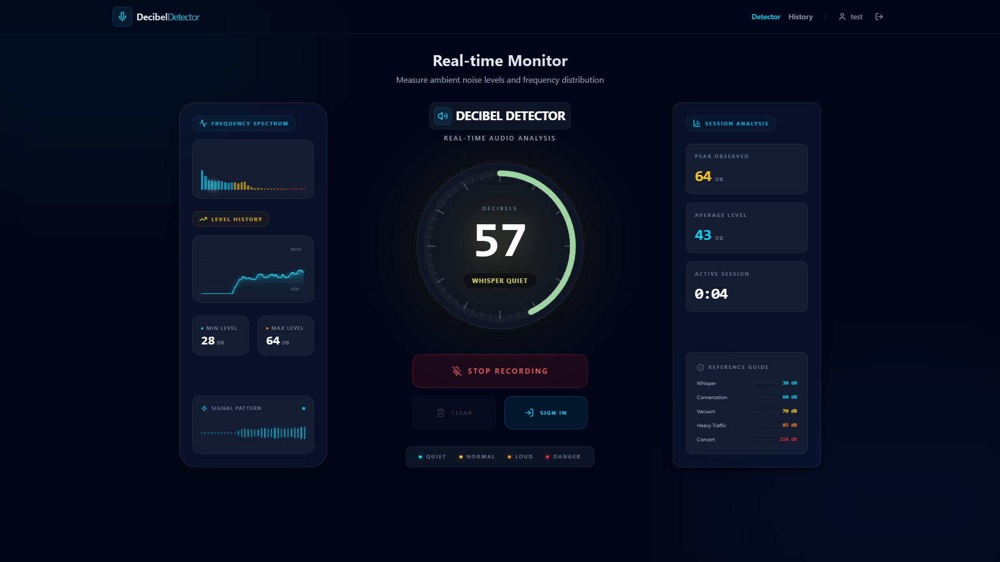
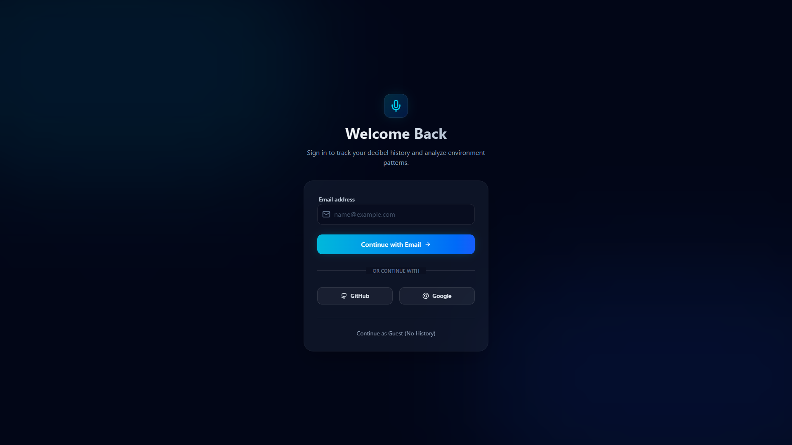
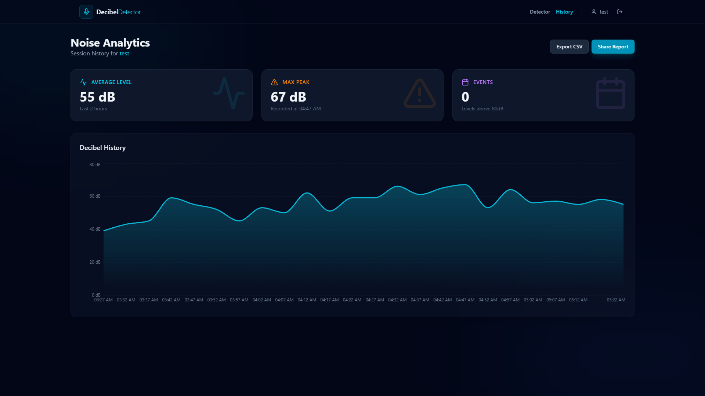

# 🎵 Decibel Detector

A real-time audio analysis application built with React, TypeScript, and Tailwind CSS. Monitor sound levels with scientific precision, visualize frequency spectrum, and track session statistics.

## ✨ Features

- 🎤 **Real-time Audio Monitoring** - Live decibel level detection using Web Audio API
- 📊 **Frequency Spectrum Visualization** - 32-band frequency analyzer with dynamic colors
- 📈 **Historical Data Tracking** - Visual graph of decibel levels over time
- 📉 **Session Statistics** - Peak, average, and duration tracking
- 🎨 **Beautiful UI** - Modern dark theme with glassmorphism effects
- 🔔 **Noise Level Indicators** - Color-coded warnings from quiet to dangerous levels
- ⚡ **Smooth Animations** - Pulsing rings and glow effects based on sound intensity

## 📸 Screenshots

### Main Dashboard



### User Authentication



### Session History & Analysis



## 🚀 Getting Started

### Prerequisites

- Node.js (v18 or higher)
- npm or yarn

### Installation

1. Clone the repository:

```bash
git clone <repository-url>
cd decibel-detector
```

2. Install dependencies:

```bash
npm install
```

3. Start the development server:

```bash
npm run dev
```

4. Open your browser and navigate to `http://localhost:5173`

### Building for Production

```bash
npm run build
```

The production-ready files will be in the `dist` directory.

## 🏗️ Architecture

### Component Structure

The application follows a modular component architecture:

```
App (Root)
└── DecibelMeter (Main Container)
    ├── FrequencyVisualizer (Left Panel)
    │   ├── FrequencyBars
    │   └── HistoryGraph
    ├── MainMeter (Center Panel)
    │   └── Legend
    └── SessionStats (Right Panel)
        └── StatsCard (×3)
```

### Key Components

- **App.tsx** - Root component with layout and theming
- **DecibelMeter** - Main container managing audio processing and state
- **FrequencyVisualizer** - Displays frequency spectrum and history
- **MainMeter** - Central circular meter with controls
- **SessionStats** - Statistics panel with peak, average, and duration

For detailed component documentation, see:

- [COMPONENT_STRUCTURE.md](./COMPONENT_STRUCTURE.md) - Architecture overview
- [COMPONENT_PROPS.md](./COMPONENT_PROPS.md) - Props reference guide

## 🎨 Technology Stack

- **React 18** - UI framework
- **TypeScript** - Type safety
- **Tailwind CSS** - Styling
- **Vite** - Build tool
- **Web Audio API** - Audio processing
- **Lucide React** - Icons

## 📱 Browser Support

The application requires browsers that support:

- Web Audio API
- MediaDevices API (for microphone access)
- Modern JavaScript (ES2022)

Recommended browsers:

- Chrome/Edge 90+
- Firefox 88+
- Safari 14+

## 🔒 Permissions

The application requires microphone access to function. You'll be prompted to allow microphone access when you click "Start Listening".

## 📊 Noise Level Reference

| Level               | Decibels  | Color    | Description                    |
| ------------------- | --------- | -------- | ------------------------------ |
| Whisper quiet       | 0-40 dB   | Cyan     | Very quiet environment         |
| Nice and peaceful   | 41-55 dB  | Cyan     | Comfortable sound level        |
| Normal conversation | 56-65 dB  | Yellow   | Typical speaking volume        |
| Getting louder      | 66-75 dB  | Orange   | Elevated noise level           |
| Pretty loud         | 76-85 dB  | Orange   | Loud environment               |
| Very loud           | 86-95 dB  | Red      | Very loud, use caution         |
| Dangerously loud    | 96-105 dB | Red      | Hearing protection recommended |
| Hearing damage risk | 106+ dB   | Dark Red | Immediate hearing damage risk  |

## 🛠️ Development

### Project Structure

```
decibel-detector/
├── public/              # Static assets
├── src/
│   ├── components/      # React components
│   │   ├── ui/         # UI primitives (Button, etc.)
│   │   ├── FrequencyBars.tsx
│   │   ├── FrequencyVisualizer.tsx
│   │   ├── HistoryGraph.tsx
│   │   ├── Legend.tsx
│   │   ├── MainMeter.tsx
│   │   ├── SessionStats.tsx
│   │   ├── StatsCard.tsx
│   │   └── index.ts
│   ├── App.tsx         # Root component
│   ├── decibel-meter.tsx  # Main logic component
│   ├── main.tsx        # Entry point
│   └── index.css       # Global styles
├── index.html          # HTML template
├── vite.config.ts      # Vite configuration
├── tsconfig.json       # TypeScript configuration
└── tailwind.config.js  # Tailwind configuration
```

### Available Scripts

- `npm run dev` - Start development server
- `npm run build` - Build for production
- `npm run preview` - Preview production build
- `npm run lint` - Run ESLint

### Adding New Components

1. Create component file in `src/components/`
2. Export from `src/components/index.ts`
3. Import using `@/components/ComponentName`

Example:

```tsx
// src/components/MyComponent.tsx
export function MyComponent() {
  return <div>Hello World</div>;
}

// src/components/index.ts
export { MyComponent } from "./MyComponent";

// Usage
import { MyComponent } from "@/components";
```

## 🎯 Features in Detail

### Audio Processing

The application uses the Web Audio API to:

1. Capture microphone input via `getUserMedia()`
2. Create an `AnalyserNode` for frequency analysis
3. Calculate RMS (Root Mean Square) for decibel conversion
4. Smooth readings using a rolling average
5. Update UI at 100ms intervals

### Frequency Visualization

- 32 frequency bands from low to high
- Color-coded by frequency range (cyan → yellow → orange → red)
- Dynamic height based on amplitude
- Smooth transitions and glow effects

### History Tracking

- 60-second rolling history
- SVG-based line chart with gradient fill
- Grid lines for reference
- Min/max indicators

## 🤝 Contributing

Contributions are welcome! Please feel free to submit a Pull Request.

## 📄 License

This project is open source and available under the MIT License.

## 🙏 Acknowledgments

- Built with [Vite](https://vitejs.dev/)
- Icons by [Lucide](https://lucide.dev/)
- Styled with [Tailwind CSS](https://tailwindcss.com/)

## 📞 Support

If you encounter any issues or have questions, please file an issue on the GitHub repository.

---

**Note:** This application requires microphone access and works best in a quiet environment for accurate readings. Always use hearing protection in loud environments!
